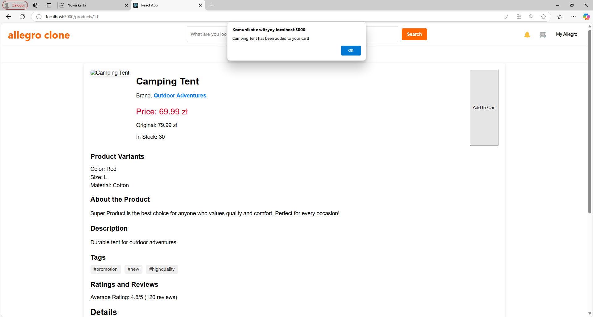
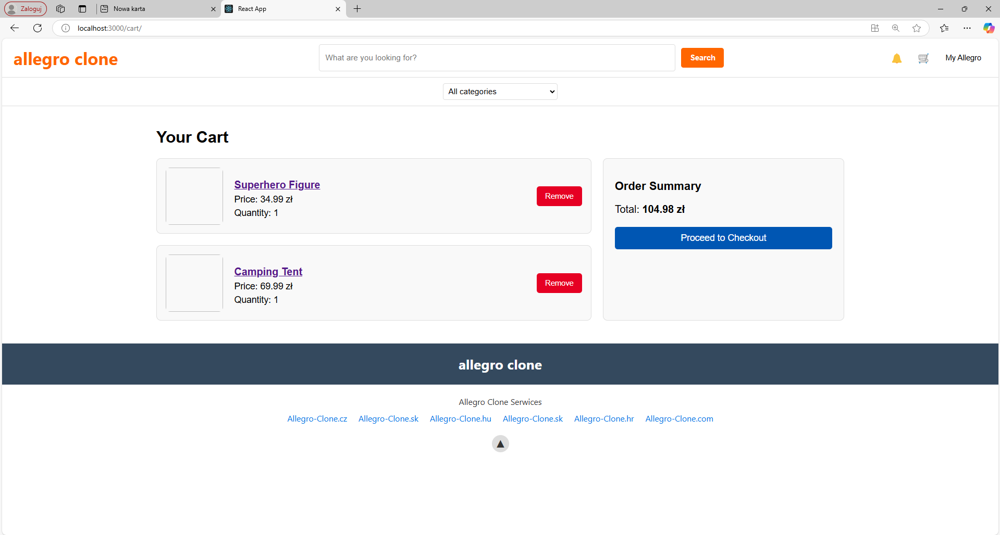

# Overview

Allegro Clone API is a demo implementation of a popular Polish e-commerce platform, similar to Amazon. This project is currently in progress, aiming to provide a seamless shopping experience with features such as browsing products, managing a shopping cart, and processing orders.

While the frontend is under active development, the [backend](https://github.com/emge1/allegro-clone-api) is also being developed and provides a REST API to support the full e-commerce platform experience.

Additionally, we are developing a [payment simulation microservice](https://github.com/emge1/payment_simulation) in Java, which will enhance the platform's
functionality and simulate real-world payment processes.

# Table of contents
* [Example screenshots](#example-screenshots)
* [Functionalities](#functionalities)
  * [Key Functionalities](#key-functionalities)
  * [Features](#features)
* [Project setup](#project-setup)
  * [Using Frontend Application](#using-the-frontend-application)
* [Dependencies](#dependencies)
  * [Backend](#backend)
  * [Frontend](#frontend)
  * [Payment simulation microservice](#payment-simulation-microservice)
* [Entity Relationship Diagram](#entity-relationship-diagram)
* [API documentation](#api-documentation)

# Demo - example screenshots






# Functionalities

## Key functionalities
* Models for core e-commerce elements like users, products, and orders.
* Serializers and views for handling data and API endpoints.
* Test coverage to ensure reliability.
* Integration with Github Actions:
  * CI workflow, including testing and building,
  * Trivy to ensure cybersecurity by scanning Docker images on each pull request and main branch push.
* Support for both local development and production environments using Docker and docker-compose.
* Development logging outputs debug-level logs to the console for effective debugging with Django Debug Toolbar.
* Production-Grade Logging and Monitoring:
  * Configured logging in production to filter sensitive information and ensure compliance with security best practices,
  * Integrated Prometheus for metrics collection and Grafana for real-time performance visualization and system monitoring.

## Features
* Registration as a merchant or a customer
* Automatic creation of cart and profile while registration
* Login authentication
* Authorization with access token
* Display random products and the cheapest one on the home page
* Display itmes and subcategories on a category page
* Display details of an item
* Add an item to personal cart
* Access to a cart only for authorized users

# Project setup

## Using the Frontend Application
Make sure the backend API is running to ensure proper functionality of the frontend application. You can find instructions for setting up the backend [here](https://github.com/emge1/allegro-clone-api).

Clone the repository:

```
git clone https://github.com/emge1/allegro-clone-frontend.git
cd allegro-clone-frontend
```

Install dependencies:

```
npm install 
```

Start the development server:
```
npm start
```

Access the application at http://localhost:3000/

# Dependencies
## Backend
### Base
* Django
* Django Rest Framework
* Python Decouple
* Pillow
* Django Cors Headers

### Local
* Django Debug Toolbar
* Pytest
* Pytest Django
* Pytest Cov
* Pytest JUnitXML
* SQLite

### Prodcution
* Postgres
* Prometheus Client

## Frontend
* React
* Axios

## Payment simulation microservice
* Spring Boot Starter Web
* Spring Boot Starter Data JPA
* Spring Boot Starter AMQP
* MySQL Connector
* Lombok
* Spring Boot Starter Test

# Entity Relationship Diagram
Below is the Entity Relationship Diagram (ERD) illustrating the relationships between the key entities in this project. Click on the image to view it in a larger size.


# API documentation

To access the API documentation, start the development server and navigate to:
http://localhost:8000/docs/

Below is a screenshot of part of the documentation.
To view a screenshot displaying all possible HTTP methods and endpoints, please click [here](media/localhost_8000_docs_.jpeg).


