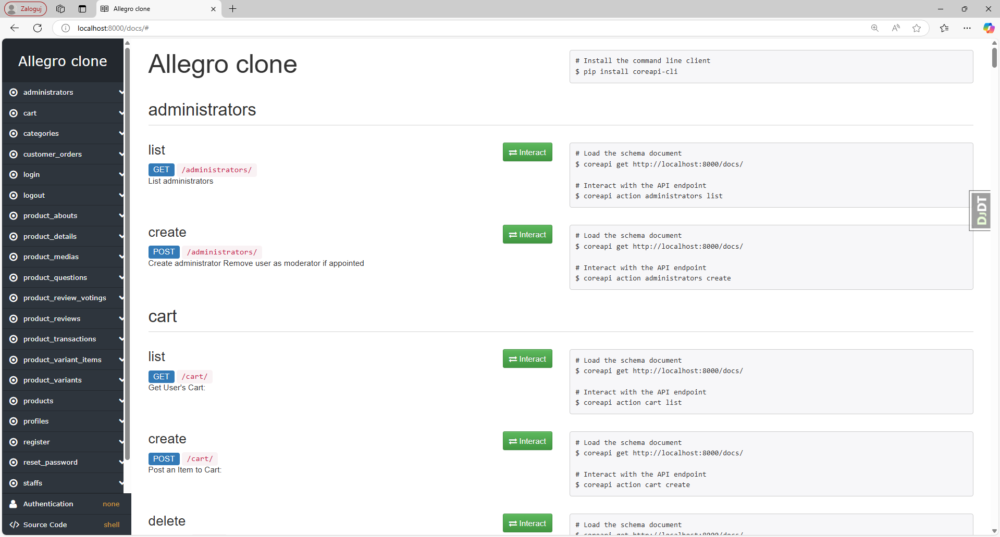
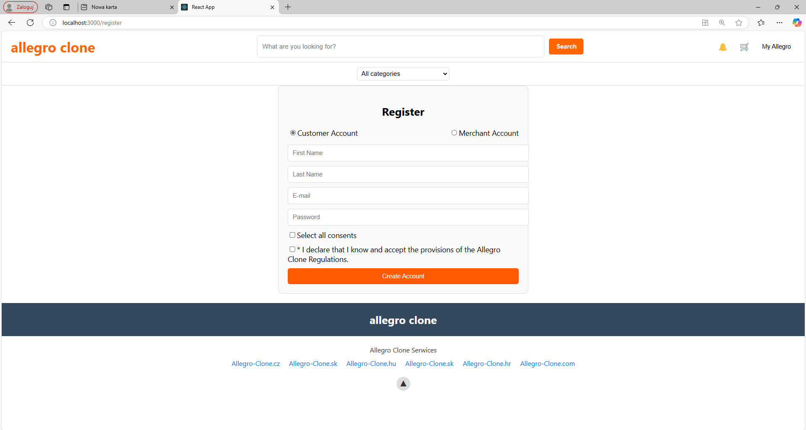

# Overview

Allegro Clone Frontend contains a demo implementation of the frontend for a popular Polish e-commerce platform, similar to Amazon. This project is currently in progress, aiming to provide a seamless shopping experience with features such as browsing products, managing a shopping cart, and processing orders.

Key functionalities include:

* Models for core e-commerce elements like users, products, and orders.
* Serializers and views for handling data and API endpoints.
* Test coverage to ensure reliability.
* GitHub Actions for automated CI workflows, including testing and building (backend part).
* Support for both local development and production environments using Docker and docker-compose.

While the frontend is under active development, the [backend](https://github.com/emge1/allegro-clone-api) is also being developed and provides a REST API to support the full e-commerce platform experience. The frontend will integrate seamlessly with the backend to deliver a dynamic and interactive user experience.


# Table of contents

* [Project setup](#project-setup)
  * [Using the Frontend Application](#using-the-frontend-application)
  * [Using Docker Compose](#using-docker-compose)
* [Dependencies](#dependencies)
* [Entity Relationship Diagram](#entity-relationship-diagram)
* [API documentation](#api-documentation)

# Project setup

## Using the Frontend Application

Clone the repository:

```
git clone https://github.com/your-username/allegro-clone-frontend.git
cd allegro-clone-frontend
```

Install dependencies:

```
npm install 
```

Start the development server:
```
npm start
```

Access the application at http://127.0.0.1:3000/

Make sure the backend API is running to ensure proper functionality of the frontend application. You can find instructions for setting up the backend [here](https://github.com/emge1/allegro-clone-api).

## Using Docker Compose
Clone the repository:

```
git clone https://github.com/emge1/allegro-clone-api.git
cd allegro-clone-api
```

Build and run the services depending on the environment:

* Local Development
```
docker-compose -f docker-compose.yml up -d web frontend
```

Access the application at http://127.0.0.1:3000/.

# Dependencies
## Backend
### Base
* Django
* Django Rest Framework
* Python Decouple
* Pillow
* Django Cors Headers
* Prometheus Client

### Local
* Django Debug Toolbar
* Pytest
* Pytest Django
* Pytest Cov
* Pytest JUnitXML
* SQLite (local)

### Production
* Postgres (production)

## Frontend
* React
* Axios

# Entity Relationship Diagram 
Below is the Entity Relationship Diagram (ERD) illustrating the relationships between the key entities in the project. Click on the image to view it in a larger size.


# API documentation

To access the API documentation, start the development server and navigate to:
http://127.0.0.1:8000/docs/

Below is a screenshot of the documentation as seen by a non-authenticated user.
To view a screenshot displaying all possible HTTP methods and endpoints for authenticated users, click [here](media/localhost_8000_docs_.png).
To view API documentation, run development server and visit http://127.0.0.1:8000/docs/



# Example screenshots




